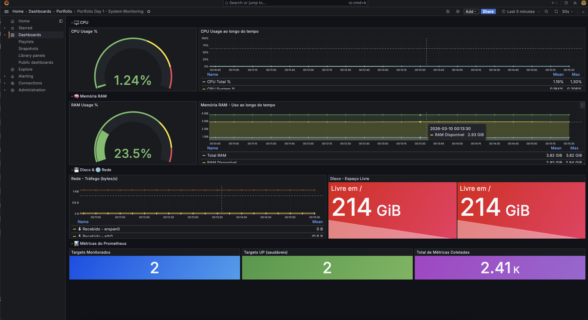

# 📊 Observability Portfolio

Stack completa de Observabilidade e Data Visualization construída como portfólio profissional.

## 🗂️ Projetos

| Dia | Nível | Projeto | Stack |
|-----|-------|---------|-------|
| [Dia 1](./dia-1-grafana-prometheus) | 🟢 Iniciante | Sistema de Monitoramento de Infraestrutura | Prometheus + Grafana + Node Exporter |
| Dia 2 | 🟡 Intermediário | Pipeline de Logs com Busca | Elasticsearch + Kibana + KQL |
| Dia 3 | 🔴 Avançado | Observability Stack Completo | Tudo integrado + OpenSearch + Power BI |

## 🛠️ Tecnologias

## �� Autor

**Lucas Mafra** — [GitHub](https://github.com/LucasOMafra)
